# 🛒 E-Shop

[](https://reactjs.org/)
[](https://redux.js.org/)
[](https://tailwindcss.com/)
[](LICENSE)

**E-Shop** is a modern e-commerce web app built with **React.js** and **Vanilla Redux** (no Redux Toolkit). It fetches product data using the **DummyJSON API** and features a clean, responsive UI with **Tailwind CSS**. The app showcases products, user reviews, and a form to submit new reviews — with a split layout on large screens.

---

## 🌐 Live Demo

🔗 [View Live on Vercel](https://your-e-shop.vercel.app)

---

## 📸 Screenshot
1.
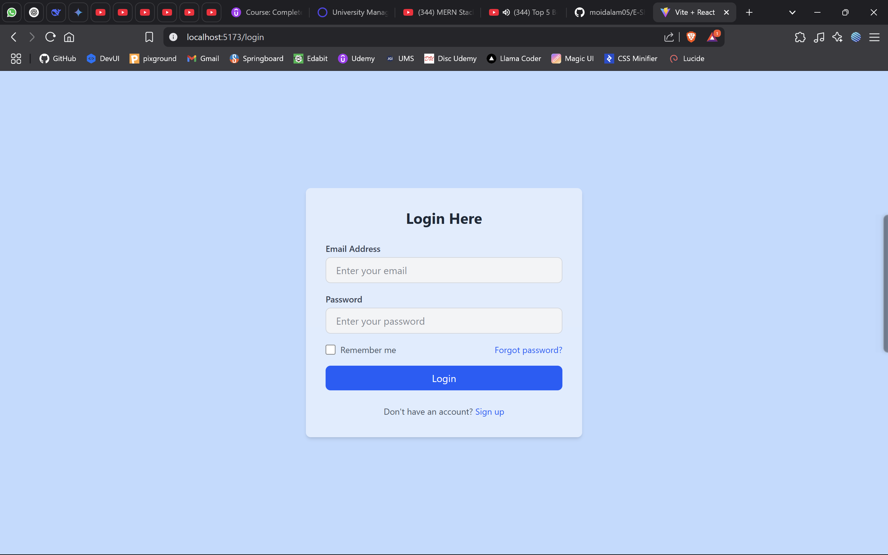
---
2.
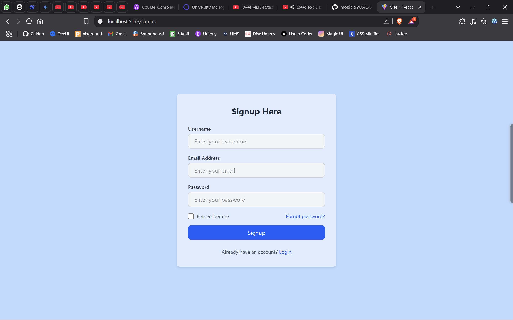
---
3.
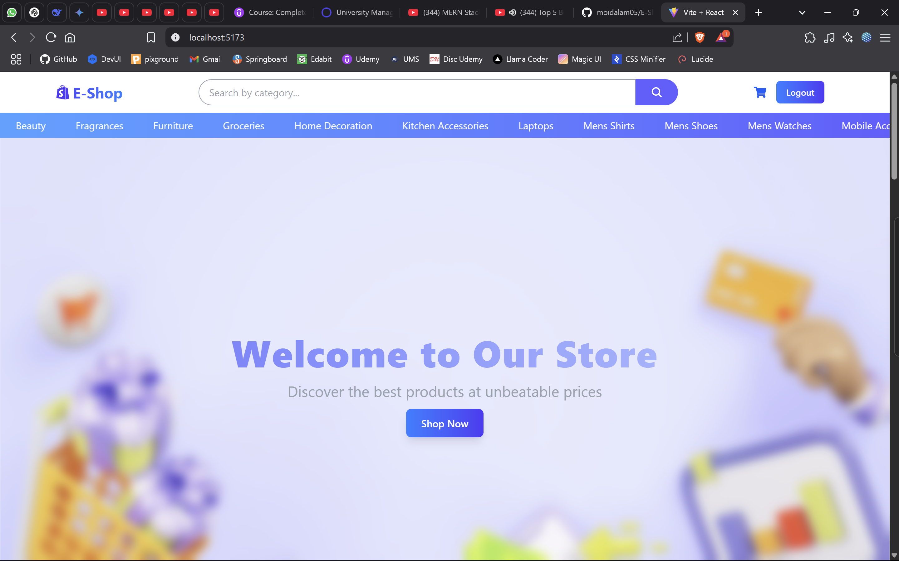
---
4.
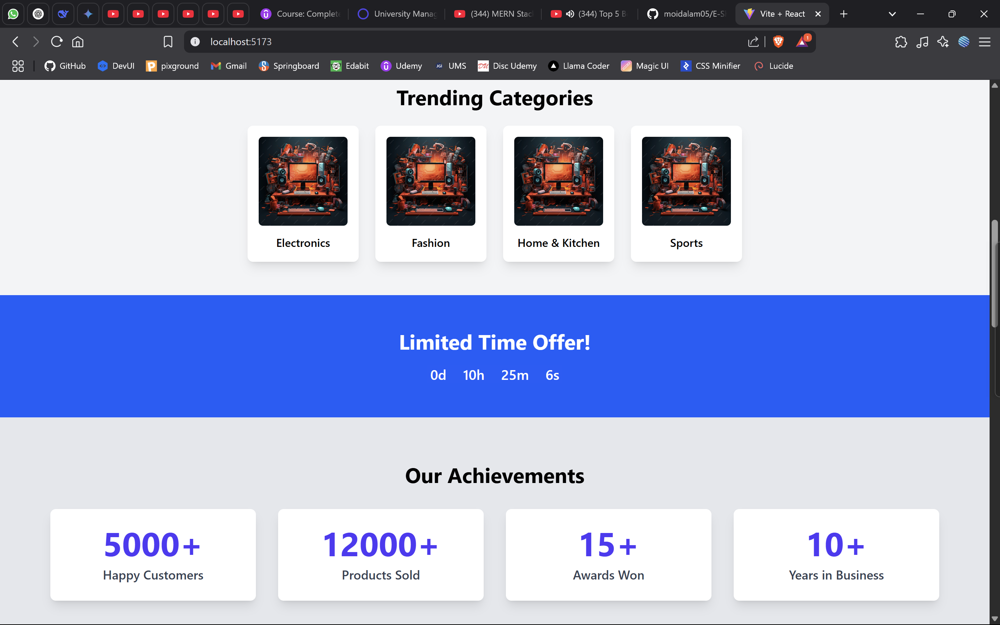
---
5.
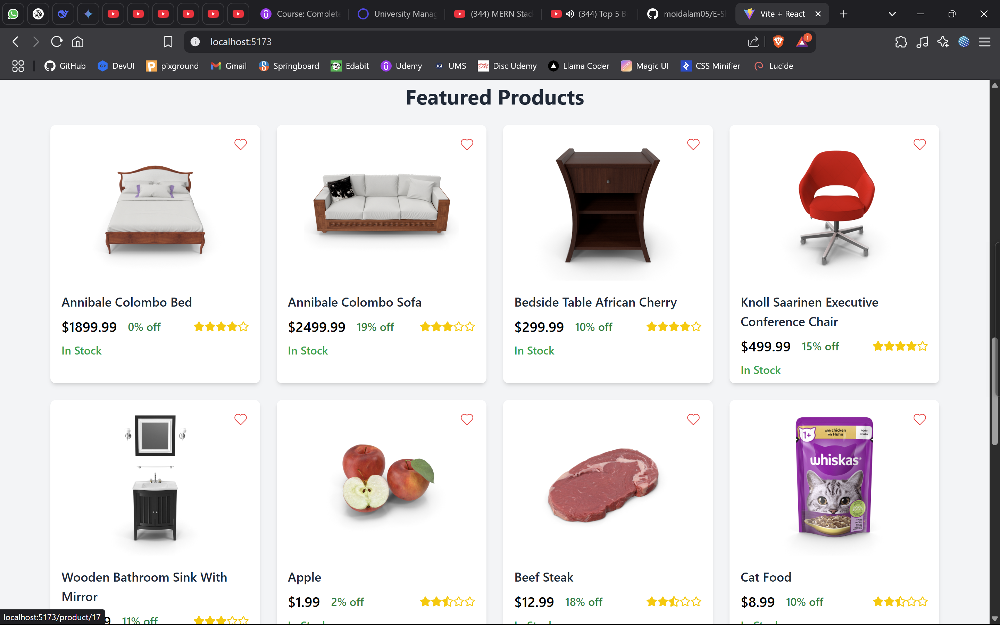
---
6.

---
7.
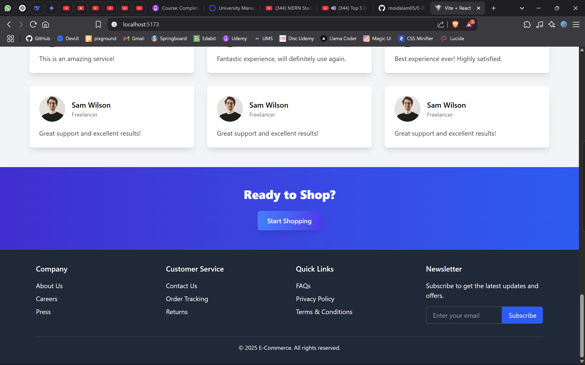
---
8.
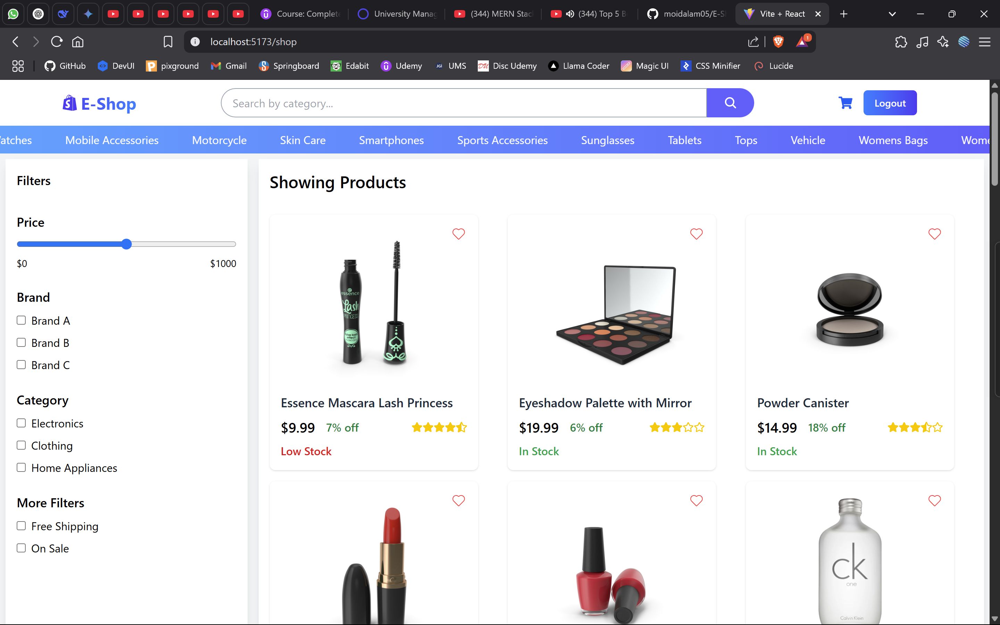
---
9.
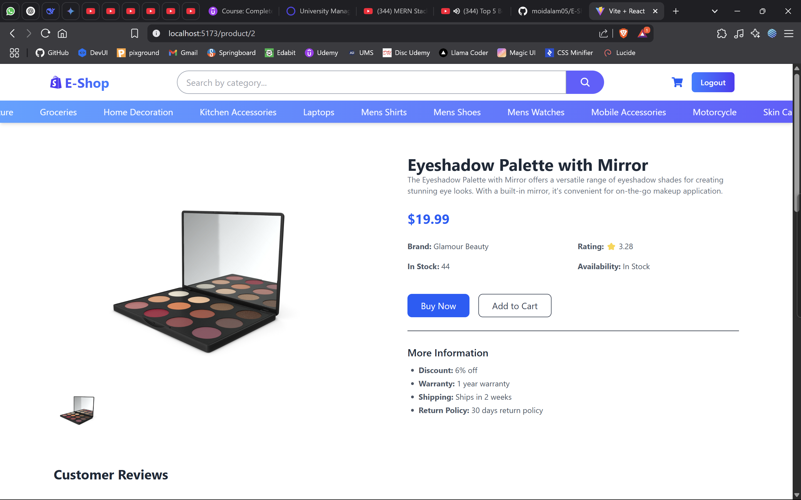
---
10.
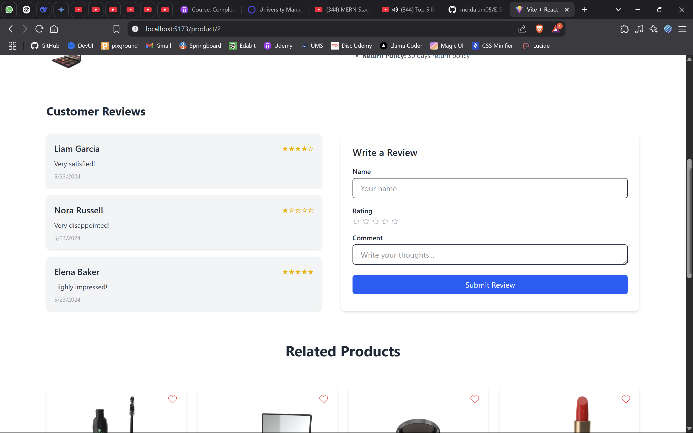
---
11.
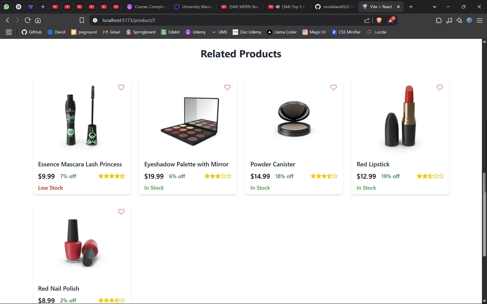
---
12.
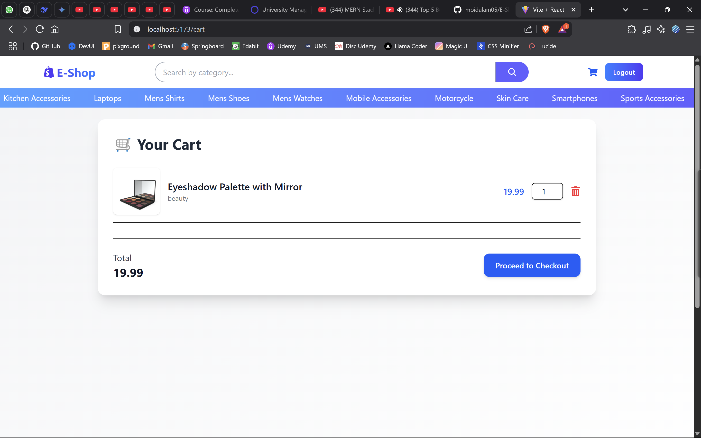
---
13.
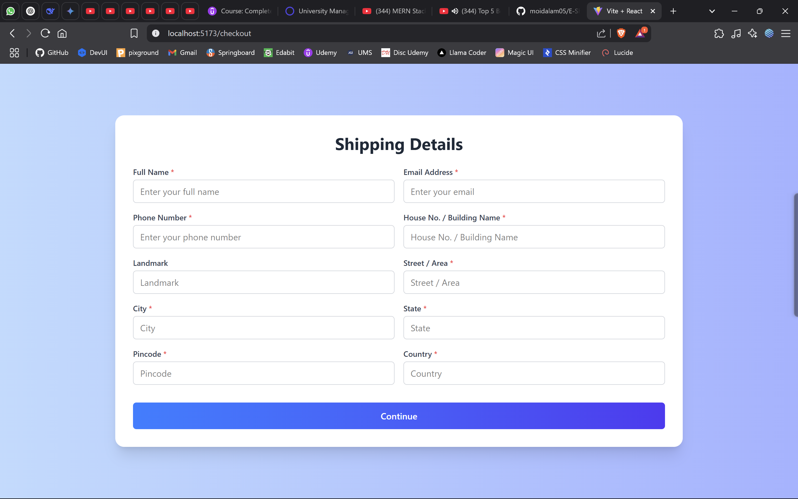
---
14.
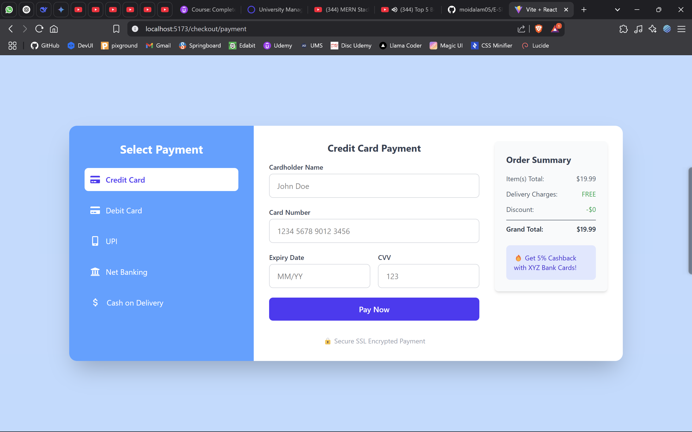
---
15.
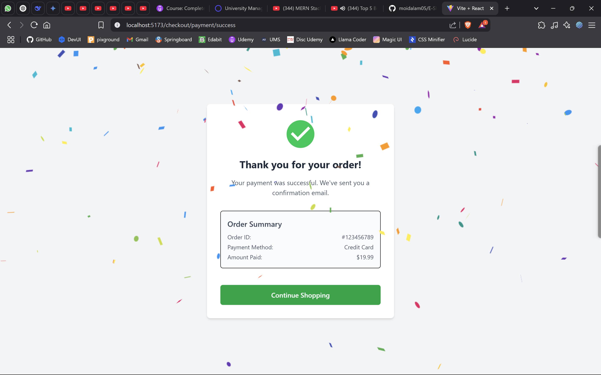
---


---

## ✨ Features

- Product listing via DummyJSON API  
- Global state handled with Vanilla Redux  
- Customer reviews with a submission form  
- Tailwind CSS for responsive design  
- Desktop-optimized dual-panel layout for reviews

---

## 🛠️ Tech Stack

- **Frontend:** React.js  
- **State:** Vanilla Redux  
- **Styling:** Tailwind CSS  
- **API:** [DummyJSON](https://dummyjson.com)

---

## ⚙️ Getting Started

```bash
git clone https://github.com/moidalam05/E-Shop-React.git
cd e-shop
npm install
npm start
```

---

## 🤝 Contribution

Contributions are welcome! If you'd like to improve this project:

- Fork the repository
- Create a new branch (`git checkout -b feature-branch`)
- Make your changes
- Commit and push (`git commit -m "Add feature"` → `git push origin feature-branch`)
- Submit a pull request

For major changes, please open an issue first to discuss what you would like to change.

> Crafted with 💙 using React, Redux, and Tailwind CSS.


